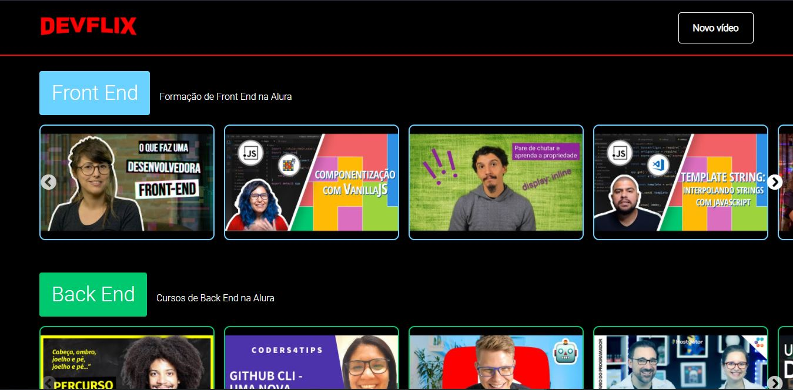

# Devflix

<p align="center">
  
</p>

> Projeto construido durante a [Imersão React da Alura](https://www.alura.com.br/imersao-react/)

## [Visualizar projeto](https://reactflix-seven-pied.vercel.app/)



## Como rodar o projeto?

Após baixar o projeto, acesse ele via seu terminal rode os comandos:

```sh
npm install
npm start
```

## Tecnologia: 
 * React

## Contatos
[Anderson Pinheiro](https://www.linkedin.com/in/anderson-pinheiro-9a1544176/)
[Alura](http://alura.com.br/)